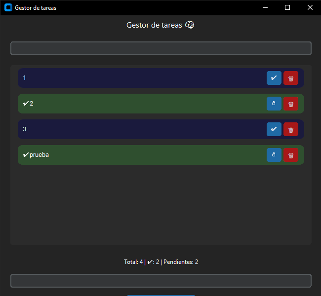

# 📝 Gestor de Tareas (Python + CustomTkinter)

Aplicación de escritorio para gestionar tareas con interfaz moderna usando CustomTkinter.


## 🚀 Características

* Agregar tareas
* Marcar como completadas (click)
* Eliminar tareas
* Búsqueda en tiempo real
* Contador de tareas
* Interfaz moderna

## 🛠️ Tecnologías

* Python
* CustomTkinter

## 🧠 Conceptos aplicados
- Programación Orientada a Objetos (POO)
- Manejo de eventos
- Persistencia de datos con archivos
- Separación lógica/UI

## ▶️ Cómo ejecutar

1. **Clona el repositorio:**
    ```bash
    git clone https://github.com/Lev-w/gestor-tareas-ctk
    cd gestor-tareas-ctk

2. **Entorno virtual:**
    ```bash
    # Windows
    python -m venv venv
    .\venv\Scripts\activate

    # Mac/Linux
    python3 -m venv venv
    source venv/bin/activate
 
3. **Instalar dependencias:**
    ```bash
    pip install -r requierements.txt

4. **Ejecutar:**
    ```bash
    python main.py
    
    # En caso de que no:
    python3 main.py

## 📌 Notas

Este proyecto fue desarrollado como práctica para mejorar habilidades en interfaces gráficas con Python.
